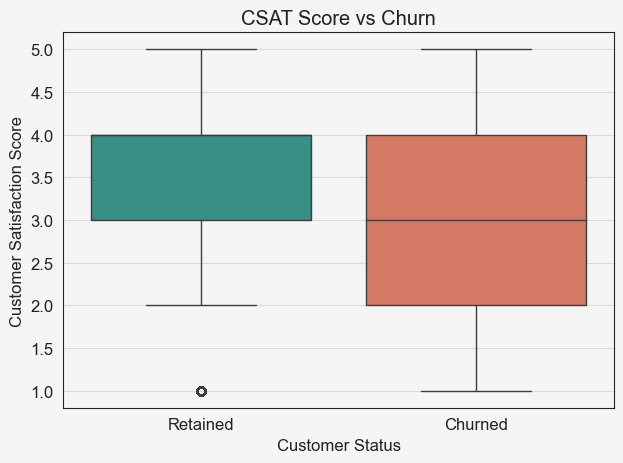
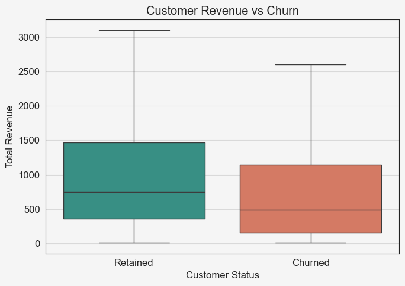

# Customer Retention and Churn Analysis

## Project Summary

Customer retention is a key challenge for subscription-based businesses, as losing customers directly impacts long-term growth and revenue. While companies often focus on increasing engagement or offering discounts, it is not always clear which factors actually influence whether a customer stays or leaves.

This project analyzes customer behavior data to identify which factors are most strongly associated with churn. By examining customer engagement, revenue, satisfaction, and marketing activity, the goal is to understand what drives retention and where businesses should focus their efforts.

---

## Research Question

Which customer behaviors and business-related factors are most strongly associated with churn and retention?

---

## Data Overview

The analysis is based on a dataset containing customer demographic, behavioral, and transactional information. It includes variables related to product usage, customer experience, revenue, and marketing engagement.

Initial exploration focused on understanding the dataset structure, key variables, and overall distribution of customer behaviors.

---

## Data Cleaning

Data preparation involved handling missing values, formatting variables, and creating new fields to support the analysis.

Key steps included:
- Creating a readable churn label (Retained vs Churned)
- Converting engagement metrics into interpretable formats (e.g., percentages)
- Ensuring numerical consistency across relevant variables

---

## Exploratory Data Analysis

Multiple visualizations were used to compare churned and retained customers across key factors, including:

- Customer engagement (monthly logins)
- Revenue (total revenue)
- Customer satisfaction (CSAT score)
- Discounts and pricing
- Marketing engagement (email open rate)

Each factor was analyzed individually to understand its relationship with churn.

---

## Analysis and Results

The analysis shows that not all customer behaviors have the same impact on churn.

Customer satisfaction stands out as the strongest factor. Customers with lower satisfaction scores were much more likely to churn, suggesting that overall experience plays a major role in retention.

Revenue also shows a clear relationship with churn. Customers who generated higher revenue were more likely to be retained, indicating that higher-value customers tend to stay longer.

In contrast, engagement metrics such as login activity showed only a small difference between churned and retained customers. Similarly, discounts and marketing engagement did not show a strong or consistent relationship with churn.

Overall, the results suggest that customer experience and value are more important drivers of retention than activity or marketing engagement alone.

---

## Key Insights

The results suggest that improving customer satisfaction should be a top priority for reducing churn. Since satisfaction shows the strongest relationship with retention, efforts such as better customer support, faster issue resolution, and improved user experience are likely to have the most impact.

Focusing on high-value customers is also important. Customers who generate more revenue tend to stay longer, which suggests that retention strategies should prioritize these segments through personalized engagement or loyalty initiatives.

In contrast, increasing activity or engagement alone may not be enough to reduce churn. Similarly, discounts and marketing efforts do not appear to have a strong influence on retention, indicating that these strategies may be more effective for acquisition rather than long-term retention.

Overall, the findings highlight that customer experience and value should be the primary focus when designing strategies to improve retention.

---

## Visualizations

### Customer Satisfaction vs Churn



### Customer Revenue vs Churn



Additional visualizations are available in the `images/` folder.

---

## Machine Learning

To further support the analysis, a logistic regression model was used to predict customer churn based on key variables identified earlier.

---

## Machine Learning Insights

The model achieved relatively high overall accuracy, but struggled to correctly identify churned customers due to the imbalance in the dataset.

Since most customers were retained, the model tended to predict retention for most cases, resulting in poor performance when identifying churn. This is reflected in the classification report, where precision and recall for churned customers are very low.

Despite this limitation, the model’s coefficients align with the earlier analysis. Customer satisfaction shows the strongest relationship with churn, while other variables such as login activity and revenue have a smaller impact.

This reinforces the earlier conclusion that customer experience plays a key role in retention, while also highlighting the challenges of predicting churn in imbalanced datasets.

---

## Project Structure
```
customer_churn_analysis/
├── data/
│ └── customer_churn_business_dataset.csv
├── notebooks/
│ └── customer_churn_analysis.ipynb
├── images/
│ ├── csat_vs_churn.png
│ ├── revenue_vs_churn.png
│ ├── logins_vs_churn.png
│ ├── discount_vs_churn.png
│ └── email_vs_churn.png
├── README.md
├── requirements.txt
└── .gitignore
```

---

## Tools Used

- Python — data analysis and processing  
- pandas — data cleaning and transformation  
- seaborn & matplotlib — data visualization  
- scikit-learn — machine learning (logistic regression)  
- Jupyter Notebook — analysis workflow  

---

## Limitations

The dataset is imbalanced, with significantly more retained customers than churned customers. This affects the performance of predictive models, making it difficult to accurately identify churn.

Additionally, some variables are simplified representations of real-world behavior, and the dataset may not capture all factors influencing customer decisions.